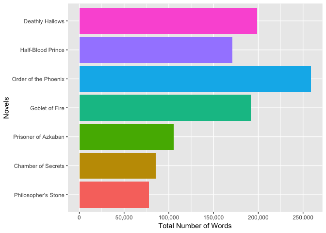
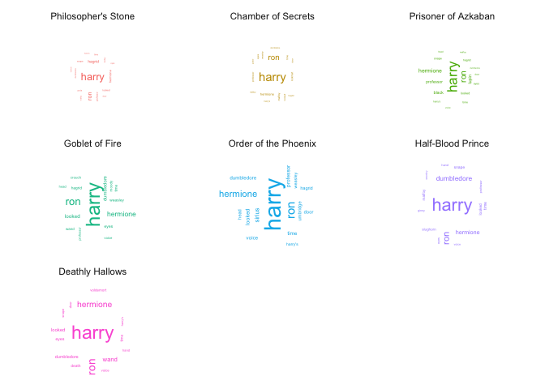

Harry Potter Text Analysis Part 1
================
Maurisio Lombera
February 01, 2021

You don't need to be a wizard to start learning text analysis.

Introduction:
-------------

In this week's post, we will be focusing on mining text data for analysis. This example uses J.K Rowling's widely known Harry Potter series and R software to mine the text. This post will demonstrate step by step how to get started

Step 1: Download the Harry Potter series.
-----------------------------------------

``` r
if (packageVersion("devtools") < 1.6) {
  install.packages("devtools")
 }

devtools::install_github("bradleyboehmke/harrypotter", force = TRUE) # provides the first seven novels of the Harry Potter series
```

    ## Downloading GitHub repo bradleyboehmke/harrypotter@master

### Load the other necessary packages for this project

``` r
# The following package tidyverse will load core packages including:
# ggplot2 (data visualization)
# dplyr (data manipulation)
# tidyr (data tidying)
# stringr (for strings)
library(tidyverse)   
```

    ## ── Attaching packages ────────────────────────────────────────────────────────── tidyverse 1.2.1 ──

    ## ✔ ggplot2 3.1.0     ✔ purrr   0.2.5
    ## ✔ tibble  2.1.3     ✔ dplyr   0.8.3
    ## ✔ tidyr   0.8.2     ✔ stringr 1.3.1
    ## ✔ readr   1.2.1     ✔ forcats 0.3.0

    ## Warning: package 'tibble' was built under R version 3.5.2

    ## Warning: package 'dplyr' was built under R version 3.5.2

    ## ── Conflicts ───────────────────────────────────────────────────────────── tidyverse_conflicts() ──
    ## ✖ dplyr::filter() masks stats::filter()
    ## ✖ dplyr::lag()    masks stats::lag()

``` r
library(harrypotter) # loads harry potter novels 
library(tidytext) # provides additional text mining functions
```

    ## Warning: package 'tidytext' was built under R version 3.5.2

``` r
library(ggwordcloud) # provides a word cloud text geom for ggplot2
```

    ## Warning: package 'ggwordcloud' was built under R version 3.5.2

``` r
library(scales) # provides added functions for data visualization
```

    ## 
    ## Attaching package: 'scales'

    ## The following object is masked from 'package:purrr':
    ## 
    ##     discard

    ## The following object is masked from 'package:readr':
    ## 
    ##     col_factor

Step 2: Tidying the text data.
------------------------------

Once all the necessary packages have been loaded, we can start preparing the text data for analysis. Textual data is often unstructured and is not suitable for even the simplest of analysis. Textual data should be formatted into a special type of data frame known as a tibble. For this example, each tibble will consist of a single chapter within each book.

### Extract and format into a tidy text tibble

``` r
# store the title of each novel within a variable
titles <- c("Philosopher's Stone",
            "Chamber of Secrets",
            "Prisoner of Azkaban",
            "Goblet of Fire",
            "Order of the Phoenix",
            "Half-Blood Prince",
            "Deathly Hallows")

# all novels will be stored in a large tibble consisting of smaller tibbles for each novel, therefore, format as a list object to store a tibble for each novel
books <- list(philosophers_stone,
                chamber_of_secrets,
                prisoner_of_azkaban,
                goblet_of_fire,
                order_of_the_phoenix,
                half_blood_prince,
                deathly_hallows)


series <- tibble() # create an empty tibble to store the text data

# for loop to unnest and create a tidy text tibble for each novel
for(i in seq_along(titles)) {

  clean <- tibble(chapter = seq_along(books[[i]]),
                  text = books[[i]]) %>% # creates a tibble containing each chapter for each novel
                  unnest_tokens(word, text) %>% # unnests each word to create a 2 column table, with each row containing a single token (word/character) and the chapter it pertains to
                  mutate(book = titles[i]) %>% # adds a third column to identify which novel each token pertains to
                  select(book, everything()) # reorders the columns within the tibble with book as the first column

  series <- rbind(series, clean) # binds the tibble of each novel by rows  
}

# set factor to keep books in order of publication
series$book <- factor(series$book, levels = titles)
```

Step 3: Text Analysis
---------------------

### Simple Analysis

Let's begin with simple analysis and count the total number of words in each novel.

``` r
series %>%
  group_by(book) %>%
  summarize(total_words = n())
```

    ## # A tibble: 7 x 2
    ##   book                 total_words
    ##   <fct>                      <int>
    ## 1 Philosopher's Stone        77875
    ## 2 Chamber of Secrets         85401
    ## 3 Prisoner of Azkaban       105275
    ## 4 Goblet of Fire            191882
    ## 5 Order of the Phoenix      258763
    ## 6 Half-Blood Prince         171284
    ## 7 Deathly Hallows           198906

Out of all seven novels, **Order of the Pheonix** is the longest novels with a total of 258,763 words, while **Philosopher's Stone** is the shortest with only 77,875 words.

Next, we'll list the top ten most commonly used words within all seven novels

``` r
series %>%
  count(word, sort = TRUE) %>% 
  top_n(10)
```

    ## # A tibble: 10 x 2
    ##    word      n
    ##    <chr> <int>
    ##  1 the   51593
    ##  2 and   27430
    ##  3 to    26985
    ##  4 of    21802
    ##  5 a     20966
    ##  6 he    20322
    ##  7 harry 16557
    ##  8 was   15631
    ##  9 said  14398
    ## 10 his   14264

To no surprise, the most common words include "the", "and", "to" "of" and "a". These are referred to as **stop words**. This information isn't very useful as within any novel, we would expect similar results. Luckily, there is a function that removes stop words from the tibble.

``` r
series %>%
  anti_join(stop_words) %>% # removes all stop words from all novels within series
  count(word, sort = TRUE) %>%
  top_n(10)
```

    ## # A tibble: 10 x 2
    ##    word           n
    ##    <chr>      <int>
    ##  1 harry      16557
    ##  2 ron         5750
    ##  3 hermione    4912
    ##  4 dumbledore  2873
    ##  5 looked      2344
    ##  6 professor   2006
    ##  7 hagrid      1732
    ##  8 time        1713
    ##  9 wand        1639
    ## 10 eyes        1604

The results are much better as now we get a better understanding of the novels. For someone who hasn't read the novel, they could easily deduce who the main characters are.

We can also extract the top three words by novel using dplyr's useful data manipulation functions

``` r
series %>%
  anti_join(stop_words) %>% # removes all stop words
  group_by(book) %>%
  count(word, sort = TRUE) %>%
  top_n(3) %>%
  rename(total_count = n) %>% # renames column to total_count
  arrange(book) # order by chronological order of publication
```

    ## # A tibble: 21 x 3
    ## # Groups:   book [7]
    ##    book                word     total_count
    ##    <fct>               <chr>          <int>
    ##  1 Philosopher's Stone harry           1213
    ##  2 Philosopher's Stone ron              410
    ##  3 Philosopher's Stone hagrid           336
    ##  4 Chamber of Secrets  harry           1503
    ##  5 Chamber of Secrets  ron              650
    ##  6 Chamber of Secrets  hermione         289
    ##  7 Prisoner of Azkaban harry           1824
    ##  8 Prisoner of Azkaban ron              690
    ##  9 Prisoner of Azkaban hermione         603
    ## 10 Goblet of Fire      harry           2936
    ## # … with 11 more rows

Aside from the **Philosopher's Stone** and **Half-Blood Prince**, the top three words in each novel are *Harry*, *Hermione*, and *Ron*

### Data Visualization

We can visualize the above analysis. Let's start by plotting the total number of words for each novel.

``` r
series %>%
  group_by(book) %>%
  summarize(total_words = n()) %>%
  ungroup() %>%
  ggplot(aes(book, total_words, fill = book)) +
    geom_bar(stat = "identity") +
    coord_flip() +
    scale_y_continuous(name="Total Number of Words",
                       labels = comma,
                       breaks = c(0, 50000, 100000, 150000, 200000, 250000, 300000)) +
    scale_x_discrete(name = "Novels") +
    theme(legend.position = "none")
```


Next, we'll plot the top 10 words used in each novel.

``` r
series %>%
  anti_join(stop_words) %>% # remove stop words
  group_by(book) %>%
  count(word, sort = TRUE) %>%
  top_n(10) %>%
  ungroup() %>%
  ggplot(aes(word, n, fill = book)) + # use data from each novel for plot
    geom_bar(stat = "identity") +
    facet_wrap(~ book, scales = "free_y") + # separates plots by novel, "free_y" shares scales across the y-axis
    labs(x = "", y = "Frequency") + # set x and y-axis labels
    coord_flip() +
    theme(legend.position="none") # Flip cartesian coordinates so horizontal becomes vertical vice versa.
```



Finally, generating word clouds is another useful way to visualize the frequency of words by novel.

``` r
set.seed(123) # for replication purposes
series %>%
  anti_join(stop_words) %>% # remove stop words
  group_by(book) %>%
  count(word, sort = TRUE) %>%
  top_n(15) %>%
  mutate(angle = 90 * sample(c(0, 1), n(), replace = TRUE, prob = c(60, 40))) %>%
  ggplot(aes(label = word,
          size = n,
          color = book,
          angle = angle
    )) +
    geom_text_wordcloud_area(area_corr = TRUE,
        eccentricity = 2) +
    scale_size_area(max_size = 7.5) +
    theme_minimal() +
    facet_wrap(~book)
```


